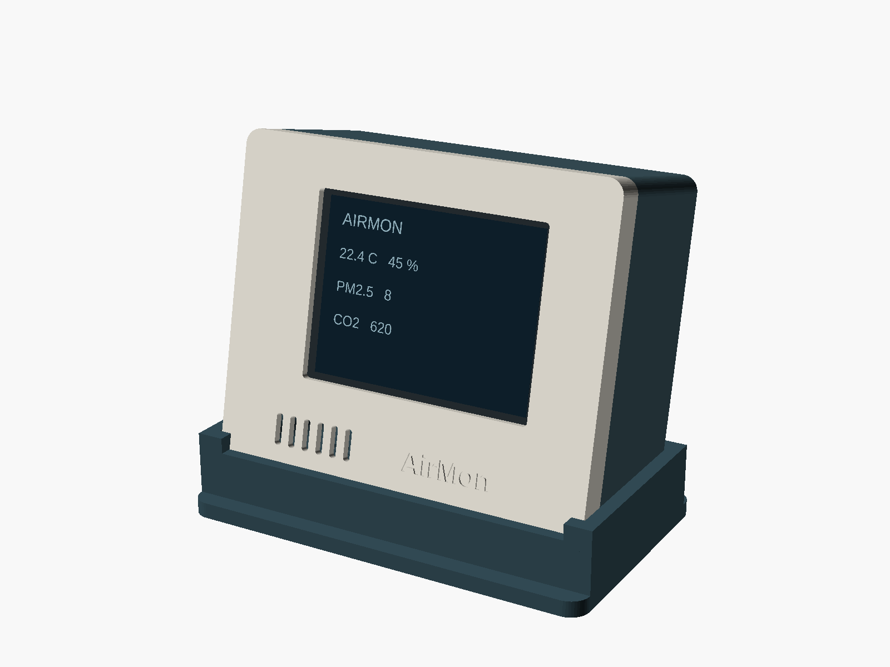
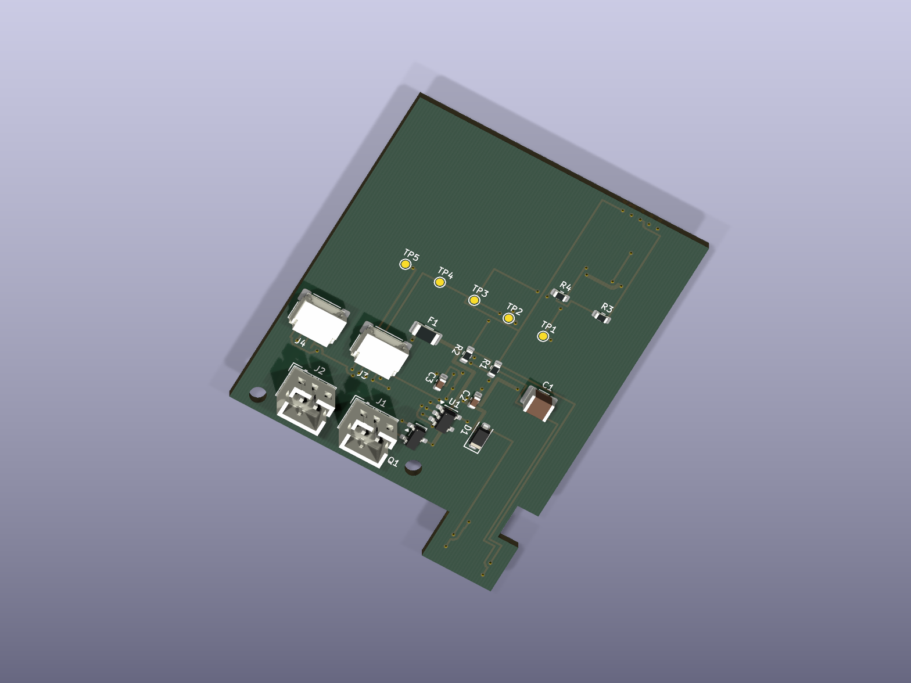
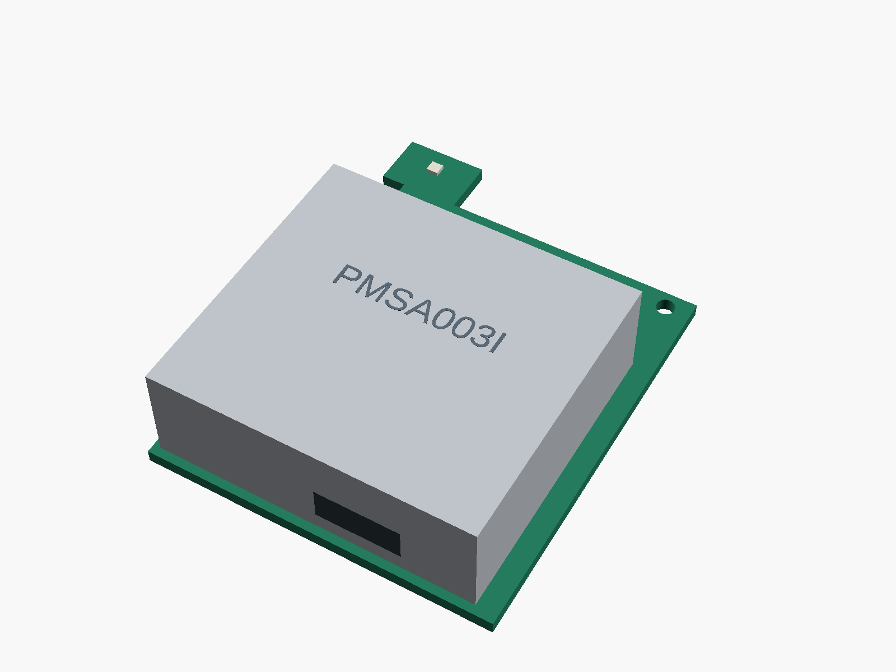

# AirMon

A USB-powered home air-quality monitor built around the **Keyestudio 2.8-inch ESP32-WROOM-32E touchscreen board**, with a small sensor carrier, printable enclosure, offline web dashboard, HTTP API, and optional Home Assistant integration.

**Prototype r0.1 — digital design, not yet physically validated.** The exact display-board mating connector and PMSA003I socket fit must be confirmed before ordering the PCB. Firmware compilation and CAD checks do not establish hardware operation. See the [validation ledger](docs/VALIDATION.md) for completed checks and remaining release gates.

*CAD rendering of the full enclosure. LCD values are illustrative; this is not a photograph or firmware screenshot. Body: 100 × 82 × 44 mm, excluding the stand; shallow body: 100 × 82 × 30 mm.*

| Measurement | Sensor | Configuration |
|---|---|---|
| Temperature / relative humidity | SHT40 | Included on the carrier |
| PM1 / PM2.5 / PM10 | PMSA003I, Adafruit 4505 | Optional removable module |
| Actual CO₂ | SCD40, Adafruit 5187 | Optional STEMMA QT module |
| VOC / NOx indices | SGP41, Adafruit 6455 | Optional STEMMA QT module |

All sensors costing more than about $10 are optional. Add the PM module to meet the original temperature/humidity/PM2.5 minimum; the lowest-cost build measures temperature and humidity only. Gas indices do not identify individual chemicals, and AirMon does not replace a smoke or carbon-monoxide alarm.

## The circuit board

*Native KiCad rendering of the routed 42 × 55 mm carrier, showing the regulator, protection, connectors, and test points. The SHT40 is on the opposite face of the extended tongue.*

*Mechanical rendering with the optional PMSA003I installed. Vendor modules and this view's carrier use simplified clearance envelopes; use the KiCad source and STEP for component-level details.*

## Build and use

1. Read [hardware and ordering](docs/HARDWARE.md), including the two connector checks.
2. Use the [BOM workbook](hardware/BOM.xlsx), [assembly CSV](hardware/assembly-bom.csv), and [purchasing CSV](hardware/purchasing-bom.csv).
3. Follow [printing and assembly](docs/ASSEMBLY.md), with the exploded CAD view.
4. [Build or flash the firmware](docs/FIRMWARE.md), then [configure and use AirMon](docs/USE.md).
5. Integrate through the [HTTP API](docs/API.md) or [MQTT/Home Assistant](docs/HOME_ASSISTANT.md).

## Deliverables

| Deliverable | Files |
|---|---|
| Editable electronics | [KiCad PCB](hardware/airmon.kicad_pcb), [schematic](hardware/airmon.kicad_sch), local libraries in `hardware/` |
| Manufacturing | [Gerber/drill ZIP](hardware/exports/airmon-gerbers.zip), [schematic PDF](hardware/exports/schematic.pdf), [assembly drawings and placement](hardware/exports/) |
| Mechanical | [PCB STEP](hardware/exports/airmon.step), [OpenSCAD source](enclosure/airmon.scad), [seven STL exports](enclosure/stl/) |
| Firmware | [ESP-IDF source](firmware/), [prototype binaries](release/firmware/) |
| Checks | [Validation ledger](docs/VALIDATION.md), [ERC](hardware/exports/erc.txt), [DRC](hardware/exports/drc.txt), [mesh checks](enclosure/mesh-validation.json), [CAD clearances](enclosure/clearance-validation.json) |
| Reproduction | [Development guide](docs/DEVELOPMENT.md), [requirements](PROMPT.md), [third-party notices](THIRD_PARTY.md) |

The project uses local Wi-Fi and HTTP. No cloud account or internet connection is required for normal readings; internet access is only used for optional clock synchronization and configured external services. History consists of 24 hours of one-minute means in RAM and resets at reboot.
