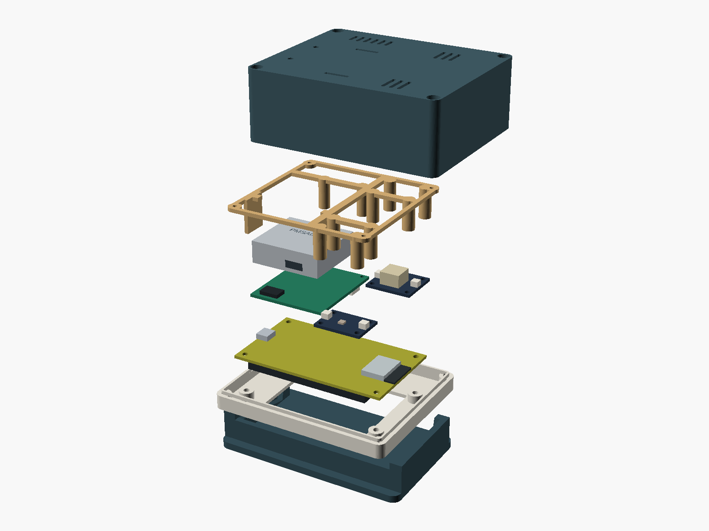

# Printing and assembly

This is an illustrated prototype assembly procedure. Check the purchased display board and PM socket against the drawings before ordering the carrier. Do not force a connector or use enclosure screws to pull misaligned parts together.

## Assembly view

From bottom to top: desktop stand, front bezel, Keyestudio display board, sensor carrier and gas breakouts, PMSA003I module, removable sensor frame, and rear shell. The display and sensor modules are simplified dimensional models. Cables, screws, and foam are omitted for clarity; their routing and compression need a physical prototype check.

The screen faces forward with a 12° recline in the stand. Printed colors are a suggestion. The illustrated LCD text is not a capture of the running firmware.

## Choose a shell

| Build | Print once each | Case fasteners |
|---|---|---|
| SHT40 only | `bezel`, `rear_shallow`, `sensor_mount_shallow`, `stand`, `fit_test` | Four M3 × 25 mm screws |
| Any optional sensor, including PM only | `bezel`, `rear_full`, `sensor_mount_full`, `stand`, `fit_test` | Four M3 × 40 mm screws; two 0.5 mm DIN 433 washers under each head |

The shared bezel is 100 × 82 mm. Installed full depth is 44 mm; shallow depth is 30 mm. The stand footprint is 108 × 65 mm. STLs already have their intended print orientation and use millimetres. Do not scale parts to make them fit a printer.

## Print settings

Start with PLA, a 0.4 mm nozzle, 0.2 mm layers, four walls, five top/bottom layers, 15% gyroid infill, and supports disabled. Use your filament manufacturer's temperature and bed settings. A brim is optional for adhesion; trim it fully from mating surfaces. The geometry is intended for support-free printing, but nut-pocket bridges and the enclosure fit still need a print test on your machine.

| Part | Face on build plate | Check after printing |
|---|---|---|
| Bezel | Flat outside/front face | Touch opening, captive M3 pockets, alignment tongue |
| Rear shell | Flat outside/back face | Open vents, unobstructed ducts, screw bores |
| Sensor frame | Broad ring face, as exported | Straight posts, captive M2/M2.5 pockets |
| Stand | Flat bottom | No rocking; case slides into cradle |
| Fit coupon | Broad flat face, as exported | Two bodies are intentional: coupon and mating strip |

Print the coupon first. Its three M3 holes are 3.1/3.3/3.5 mm, with nut pockets 5.6/5.8/6.0 mm across flats. The design uses the middle option. The separate strip checks nominal 0.3 mm clearance per side. Two additional pockets check the M2 and M2.5 nuts. Nuts should seat without splitting PLA. Adjust the OpenSCAD dimensions if your printer cannot reproduce these fits; regenerate and re-check all affected parts.

## Assemble the electronics

1. Inspect the carrier for solder bridges, correct U1/Q1/D1 orientation, and an unobstructed SHT40 opening. Avoid touching, washing, or coating the sensor on the small tongue.
2. Fit J1/J2 through-hole connectors if the assembly service did not install them. For PM support, install the **socket supplied with the PMSA003I kit** at J5. Check its pad map and orientation before soldering. This one-time step is required if J5 was omitted from PCBA assembly; subsequent PM installation is plug-in.
3. Build and continuity-check both harnesses using the [pin-to-pin table](HARDWARE.md#harnesses). Both carrier connectors have the same housing, so label them **POWER** and **I2C** at both ends. Interchanging them can apply 5 V to a signal pin.
4. Perform the unloaded and loaded rail checks in [hardware validation](HARDWARE.md#first-power-checks) before installing all modules.

## Fit the enclosure

1. With USB disconnected, insert four M3 display nuts and four M3 closure nuts into the bezel pockets. Remove stray plastic; avoid glue near sensor air paths.
2. Place the display face down into the bezel and use four M3 × 6 mm screws through its mounting holes. Tighten gently and evenly. The bezel should bear on its mounting posts, with clearance around the resistive panel. Check touch operation again after assembly.
3. Insert two M2 carrier nuts into the sensor frame posts. Add M2.5 nuts for installed gas modules. Slide the carrier's upper edge into the guides, with the SHT40 tongue pointing toward the lower room-air vents. Secure its two holes using M2 × 5 mm screws from the underside.
4. If using PM, seat the module straight onto J5 without loading the socket sideways. The frame lips retain the metal body. Apply thin foam under the retaining lips only if needed; never cover a port or crush the module.
5. Attach SCD40 and/or SGP41 to their matching four-hole mounts with M2.5 × 6 mm screws. In assembly coordinates the SGP41 is at the upper right and SCD40 at the lower right. Use one 100 mm QT cable from J3/J4 to each module; either socket can serve either module.
6. Route power and I²C harnesses toward the USB side and QT cables around the frame. Secure slack with cable ties through frame openings, leaving room to unplug connectors. Keep wires clear of the ESP32 antenna at the display board's right edge, vents, PM ports, and SHT40 tongue.
7. For PM, fit 0.5 mm foam around the two duct interfaces. Trim it to bridge the nominal 0.3 mm gap without obstructing intake or exhaust. Do not join the separate ducts with a common foam cavity. Confirm the actual module ports align before closing.
8. Insert four M2 nuts into the rear-shell frame anchors. Fit the populated sensor frame to the rear shell with four M2 × 6 mm screws. Check that wires can flex in the display-to-carrier gap without pressing on components. The CAD check leaves approximately 2.6 mm above the modeled rear display components; connector exits need a physical check.
9. Connect the labeled harnesses, close the shell on the alignment tongue, and use the correct four case screws. On the full shell, the two specified washers per screw set the thread depth. Stop if a screw bottoms out before the shell closes.
10. Add four feet beneath the stand and slide the unit into it. Check stability, USB clearance, and unobstructed air openings. BOOT/RESET are accessible through rear probe holes; use a nonconductive probe.

## Verify before routine use

Run the [physical acceptance procedure](VALIDATION.md#physical-acceptance-procedure). Compare temperature against a separate reference after thermal equilibrium, both with and without optional modules. An offset cannot correct an error that changes with brightness, airflow, or sensor loading; revise placement or isolation if necessary.

Unplug USB before adding or removing modules. Use the full shell and frame for any upgrade. Firmware auto-detects supported I²C addresses. Keep the microSD slot empty in every configuration.
