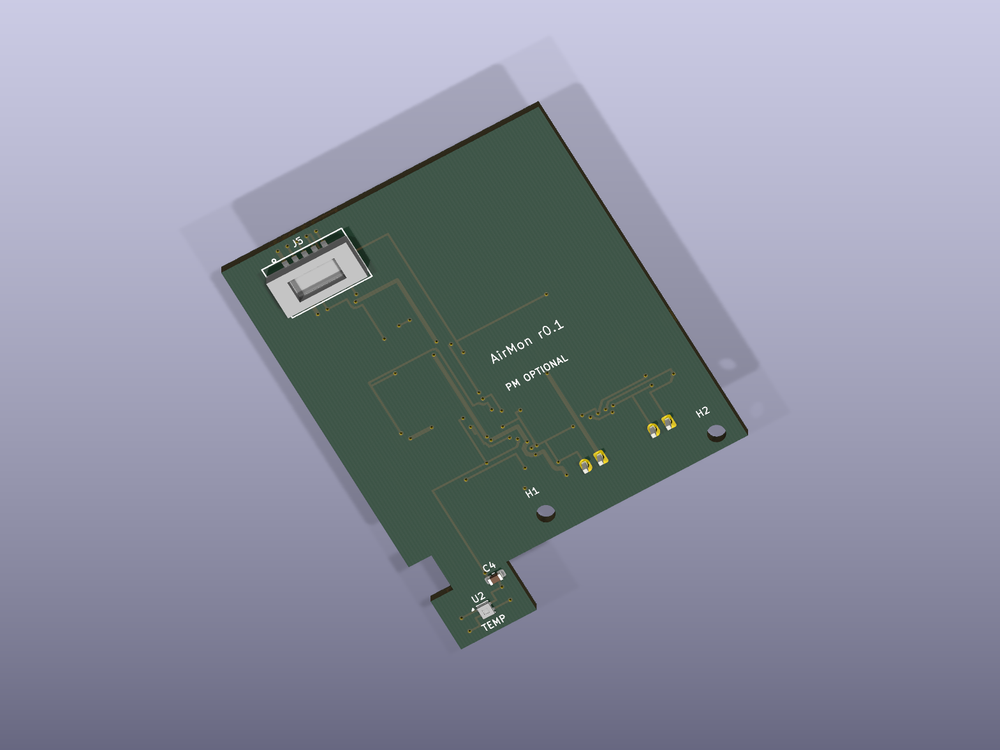

# Hardware and ordering

## Release status

The PCB passes ERC/DRC. This is a **prototype engineering package**. Two purchased-part checks remain before fabrication: the display's exact 1.25 mm connector series and the PMSA003I supplied socket land pattern/mating height. Neither can safely be inferred from pitch alone. The BOM explicitly marks the unresolved board housing.

Match the delivered [Keyestudio board](https://www.keyestudio.com/products/28-inch-esp32-32e-display-screen-lcd-tft-module-with-touch-wroom-for-arduino) to [LCDWIKI E32R28T documentation](https://www.lcdwiki.com/2.8inch_ESP32-32E_Display). This project targets classic ESP32, 4 MB flash, ILI9341V LCD, and XPT2046 touch. Similarly sized boards may have different pinouts.

## Carrier and pins

*The optional PM socket is at the top of the board; SHT40 sits on the lower tongue. Simplified socket/sensor STEP envelopes still require a mating-height check.*

The carrier has a 42 × 48 mm main area plus a 10 × 7 mm SHT40 extension, 42 × 55 mm overall. It uses two copper layers and 1.6 mm FR-4. PMSA003I sits on top; power components and cable connectors sit underneath. Two M2 holes and printed edge guides support it.

| Function | ESP32 GPIO |
|---|---|
| LCD MOSI / MISO / SCLK | 13 / 12 / 14 |
| LCD CS / DC / backlight | 15 / 2 / 21 |
| Touch MOSI / MISO / SCLK | 32 / 39 / 25 |
| Touch CS / IRQ | 33 / 36 |
| Sensor SDA / SCL | 19 / 18 |
| Sensor 5 V enable | 22, LOW; shares red LED |
| Unused audio disable | 4, HIGH |
| SD deselect | 5, HIGH; card slot must stay empty |

LCD reset follows ESP32 EN. GPIO19/18 share the disabled microSD interface. The switched UART supply comes through the display-board Q5 circuit. GPIO22 HIGH does not guarantee full power disconnection because its gate drive is 3.3 V and its source is USB 5 V. Disconnect USB for service. Battery operation is unsupported. [Manufacturer schematic](https://www.lcdwiki.com/res/E32R28T/2.8inch_ESP32-32_Display_Schematic.pdf).

## Harnesses

These are schematic pin numbers, **not left-to-right visual instructions**. Identify pin 1 and verify continuity on the actual board. Do not rely on wire colors or assume the same view at opposite connector ends.

| Harness | Display end | Carrier end | Suggested color |
|---|---|---|---|
| POWER | UART P2 pin 1, switched USB 5 V | J1 pin 1 | Red |
| POWER | UART P2 pin 2, GND | J1 pin 2 | Black |
| I2C | SPI P3 pin 2, GPIO19 | J2 pin 1, SDA | Blue |
| I2C | SPI P3 pin 3, GPIO18 | J2 pin 2, SCL | Yellow |

Leave UART TXD/RXD pins 3/4, SPI GPIO23/GPIO27 pins 1/4, and connector shield/mounting positions out of the signal harness. Common ground comes through POWER. Target 100 mm wires, 26 AWG stranded. Carrier mating parts: JST **PHR-2** housings and **SPH-002T-P0.5S** contacts, mating to **B2B-PH-K-S(LF)(SN)**. Board ends must use confirmed matching pigtails or a positively identified housing/contact set; their exact MPN is still pending.

J1 and J2 are electrically different but mechanically interchangeable: label both harnesses and never swap them. J3/J4 use JST SH STEMMA QT pinout: 1 GND, 2 sensor 3.3 V, 3 SDA, 4 SCL. Do not apply 5 V to QT.

## Optional modules

| Module | Address | Procurement |
|---|---|---|
| SHT40 | `0x44` | Required SMT sensor on carrier |
| PMSA003I | `0x12` | [Adafruit 4505](https://www.adafruit.com/product/4505), bare I²C module with mating socket |
| SCD40 | `0x62` | [Adafruit 5187](https://www.adafruit.com/product/5187), plus QT cable |
| SGP41 | `0x59` | [Adafruit 6455](https://www.adafruit.com/product/6455), plus QT cable |

The PM part is not PMSA003 UART, PMS5003, or the larger Adafruit breakout. Socket numbering follows the [Plantower manual](https://cdn-shop.adafruit.com/product-files/4632/4505_PMSA003I_series_data_manual_English_V2.6.pdf): 1/2 VCC, 3/4 GND, 5 RESET, 6 NC, 7 SCL, 8 NC, 9 SDA, 10 SET. R3/R4 hold RESET/SET high at 3.3 V. Generic Eagle connector numbering in the Adafruit reference differs; check the mating view before translating numbers.

For later plug-in PM upgrades, have the supplied J5 socket consigned and fitted during PCBA assembly. If omitted, adding PM requires one-time socket soldering. No independently verified socket order code is claimed. Check it against the [1:1 footprint print](../hardware/exports/footprint-fit-1to1.pdf) and measure the assumed 2 mm mating height before fabrication.

## Power and I²C budget

Use a regulated 5 V, 2 A USB-A supply and short USB-A-to-C data cable. The following is a **design allowance, not a measurement**: display/ESP32 600 mA peak, PM 100 mA active plus 100 mA startup margin, and the 3.3 V sensor rail 250 mA including CO₂ pulses, gas heater, pull-ups, breakout LEDs, and margin. Total allowance: 1.05 A at 5 V. Validate the display-board USB connector/Q5 path and actual cable drop under load.

SCD40 specifies 205 mA peak and 15 mA average at 3.3 V. SGP41 specifies 3.0 mA typical measurement average and 4.6 mA maximum conditioning average at 3.3 V. Breakout overhead and pulse loads require bench testing. [SCD40 specifications](https://sensirion.com/products/catalog/SCD40), [SGP41 datasheet, table 2](https://sensirion.com/media/documents/5FE8673C/61E96F50/Sensirion_Gas_Sensors_Datasheet_SGP41.pdf).

AP2112K U1 is rated 600 mA and has ceramic input/output decoupling. At the 250 mA allowance, `(5 − 3.3) × 0.25 = 0.425 W` is an instantaneous dissipation estimate. The datasheet's 184 °C/W junction-to-ambient figure would imply a 78 °C rise if that load were continuous; that is not an acceptable assumed continuous operating point in warm ambient conditions. Expected average sensor current is much lower, but verify regulator temperature and rail droop fully populated. [AP2112 datasheet](https://www.diodes.com/assets/Datasheets/AP2112.pdf).

F1 is a 1 A hold resettable fuse in the carrier branch; Q1 protects against reverse input polarity. D1 is a transient suppressor, **not regulated overvoltage protection**: its clamp can exceed the LDO absolute input rating. Use regulated USB 5 V only. C1 provides local bulk capacitance; measure PM startup droop instead of assuming it is eliminated.

The carrier has 4.7 kΩ pull-ups per I²C line. Each referenced gas breakout has **two 10 kΩ branches per line**, on opposite sides of its MOSFET level shifter. When LOW, both branches contribute current; treating their supplies as 3.3 V gives a conservative 5 kΩ equivalent per installed breakout. Actual sensor-side voltage is affected by its onboard regulator. Check the delivered revisions and PM idle resistance.

| PM | CO₂ | VOC/NOx | Conservative LOW equivalent | LOW current, 3.3 V |
|---|---|---|---|---|
| Off | Off | Off | 4.70 kΩ | 0.70 mA |
| On | Off | Off | 4.70 kΩ | 0.70 mA |
| Off | On | Off | 2.42 kΩ | 1.36 mA |
| On | On | Off | 2.42 kΩ | 1.36 mA |
| Off | Off | On | 2.42 kΩ | 1.36 mA |
| On | Off | On | 2.42 kΩ | 1.36 mA |
| Off | On | On | 1.63 kΩ | 2.02 mA |
| On | On | On | 1.63 kΩ | 2.02 mA |

The table assumes PM adds no pull-ups; include any internal pull-up found by measurement. These LOW-current equivalents are not a complete level-shifter rise-time model. At 100 kHz, a 4.7 kΩ pull-up and assumed 200 pF bus give `tr ≈ 0.8473 × R × C = 0.80 µs`. Measure rise time and LOW voltage at the farthest module for all eight configurations. Capacitance and actual module pull-up currents have not been measured. All four sensor addresses are distinct.

## PCBway order package

After resolving the connector checks, upload [airmon-gerbers.zip](../hardware/exports/airmon-gerbers.zip) for two-layer, 1.6 mm FR-4, 1 oz copper. Specify solder mask both sides and a lead-free finish; no controlled impedance is required. Use the manufacturer's standard finish or ENIG for fine-pitch assembly. This layout uses approximately 0.25 mm minimum tracks and 0.20 mm clearance, with 0.30 mm via drills and 0.60 mm pads. Preserve the outline and SHT40 tongue exactly.

For assembly, supply [assembly-bom.csv](../hardware/assembly-bom.csv), [placement-smt.csv](../hardware/exports/placement-smt.csv), [fabrication drawing](../hardware/exports/fabrication-drawing.pdf), [top](../hardware/exports/assembly-top.pdf) and [bottom](../hardware/exports/assembly-bottom.pdf) drawings, and [schematic](../hardware/exports/schematic.pdf). Placement uses KiCad drill origin and millimetres; bottom coordinates are not X-negated. Confirm bottom orientation and polarized pin 1 in the assembler's preview. J1/J2 need a separate through-hole step; J5 is optional and may need consignment. Test points and holes are not purchased parts.

Do not wash or conformally coat over SHT40. Agree on a sensor-compatible assembly process. [BOM.xlsx](../hardware/BOM.xlsx) distinguishes listed prices, estimates, and unknown quotes, dated 2026-09-06. PCBA setup, stencil, shipping, taxes, and uncertain harness pricing are not included in a purported total.

## First power checks

With USB disconnected, verify no 5 V-to-GND short and check each harness conductor against the table. Flash the display with the carrier disconnected so GPIO22 is configured. Confirm UART P2 pin 1 is near 5 V relative to pin 2. Remove USB, connect the carrier without optional modules, then power while monitoring current.

Measure TP1 GND, TP2 SENSOR5V, TP3 SENSOR3V3, TP4 SDA, and TP5 SCL. Target TP3 at 3.3 V ±5%. PM needs 4.5–5.5 V at its input, including startup dips; use an oscilloscope. Unplug before adding each module. Record total current, rail minima, regulator temperature, I²C rise time, and behavior at minimum/maximum brightness for all eight module combinations. Finish with the [fully populated 24-hour run](VALIDATION.md#physical-acceptance-procedure).
