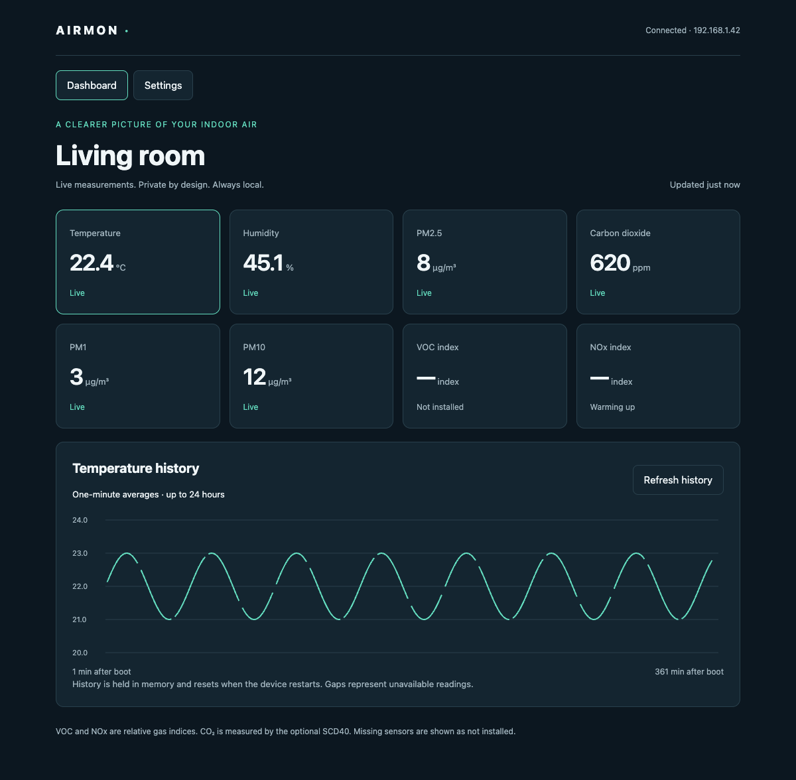

# Setup and daily use

## First boot

1. Connect USB power and complete the four-point touch calibration, tapping and releasing each cross. If calibration is inaccurate, repeat it from Settings.
2. Open **Settings → Wi-Fi setup / credentials**. BOOT held for five seconds during normal operation opens this page even if touch is unusable.
3. Join the displayed `AirMon-xxxxxx` Wi-Fi network using its unique 16-character password. If the captive page does not open, browse to **http://192.168.4.1**. Stay connected if your phone reports that this network has no internet.
4. In web Settings, enter the displayed 32-character administrator token. The LCD splits it across two lines: concatenate them without a space or newline. Enter your 2.4 GHz home Wi-Fi SSID and password, then Save settings.
5. Allow up to 40 seconds for the connection test. Settings are saved only after connection succeeds. A failed change restores the previous configuration. On success, the setup AP closes after 60 seconds; reconnect your phone to the home network.
6. Open the IP address displayed by AirMon, or `http://airmon-xxxxxx.local` using the same suffix. If multicast DNS is unavailable, use the router's DHCP lease list or reserve an IP address.

The setup AP is WPA2 protected. Its password and administrator token persist across reboots. The web token is held in the page's memory and disappears on reload/close; it is not stored in browser local storage. The credentials page can be reopened physically at any time.

## LCD and dashboard

*Actual dashboard rendered in Chrome against a simulated API. These are test values, not measurements from a physical prototype.*

The landscape overview shows eight metrics. Tap a tile for its trend and sensor state. Settings controls brightness and touch calibration; network and sensor settings are primarily configured in the web page. A short BOOT press cycles overview, trend, and settings pages. The default backlight is 30%; it dims after 120 seconds without input. Brightness is adjustable from 5–100%, and setting the dim timer to zero disables dimming.

The dashboard refreshes readings every three seconds. Select a metric for its chart. Charts hold up to 24 hours of one-minute means, with gaps for missing or invalid data. No history is written to flash; rebooting starts a new history. SNTP provides UTC when reachable. Without internet, the monitor uses uptime and continues measuring normally.

| Display/API state | Meaning |
|---|---|
| `absent` | Sensor address not detected; optional module may be uninstalled |
| `warming_up` | Detected but initial settling is incomplete |
| `valid` | Fresh validated reading |
| `stale` | Recent measurement failed or is too old; value is unavailable |
| `failed` | Repeated errors or initialization/self-test failed |

PMSA003I has a 30-second firmware warmup. CO₂ updates about every five seconds. Gas indices are held in warmup for **90 minutes for VOC and six hours for NOx** after sensor initialization, reflecting the datasheet's index settling guidance. They relearn after reboot. SHT40 temperature and humidity are required for real-time gas compensation; if those readings are unavailable, gas indices become stale. Gas indices represent relative changes, not identified chemical concentrations. [SGP41 startup specification](https://sensirion.com/media/documents/5FE8673C/61E96F50/Sensirion_Gas_Sensors_Datasheet_SGP41.pdf).

## Calibration and placement

Place the monitor on an indoor desk or shelf with clear air around the vents, away from direct sun, a heating outlet, and direct exhaled breath. Keep intake and exhaust uncovered. Its humidity/temperature tongue reduces heat coupling but does not prove ambient accuracy.

For temperature correction, place an independent reference nearby, allow both instruments to equilibrate, and set **Temperature correction** to `reference − AirMon`. Compare at multiple temperatures and brightness settings; a changing bias needs a mechanical or thermal correction rather than a single offset. Relative humidity is not recalibrated by the temperature offset.

SCD40 automatic self-calibration is **off by default**. Enable it only where the sensor regularly encounters fresh outdoor-equivalent air under the manufacturer's conditions. Set installation altitude in metres. For forced CO₂ recalibration, use a known reference between 400 and 2,000 ppm and leave the sensor operating in stable reference air for at least three minutes before requesting calibration. Do not assume arbitrary room air is 400 ppm. The result appears in device status. Consult [Sensirion's SCD40 documentation](https://sensirion.com/products/catalog/SCD40) for reference conditions and calibration limitations.

## Network and security assumptions

Normal reads need no authentication. Configuration, calibration, and firmware updates need the per-device bearer token. HTTP on the LAN is not encrypted; Wi-Fi/MQTT credentials are stored in device NVS without flash encryption. Use a trusted private network, and do not expose the HTTP port directly to the internet. MQTT is optional; `mqtts://` uses publicly trusted server certificates. Device and broker availability are separate.

Wi-Fi outages preserve settings and readings on the LCD while the device reconnects. BOOT can reopen setup. Leaving a Wi-Fi or MQTT password field blank preserves it; use the explicit clear-password checkbox to clear it. Configuration changes are asynchronous: wait for “Settings saved” or the failure result before making another change.

## Troubleshooting

| Symptom | Check |
|---|---|
| Blank LCD | Correct ESP32 image, USB supply/data cable, RESET, serial log; LCD pinout must match E32R28T |
| Touch misses targets | Recalibrate; check that bezel edges do not press on the panel |
| PM absent | Bare PMSA003I, correct socket/pins, GPIO22 LOW, 5 V under load; keep SD empty |
| Both gas modules absent | QT pinout and 3.3 V, correct Adafruit boards, carrier harness SDA19/SCL18 |
| Gas indices warming for hours | Expected settling; avoid repeated power cycling |
| All sensors fail together | Common ground, swapped POWER/I2C harness, bus held LOW, supply droop |
| Temperature too high | Vents, proximity to heat, brightness, PM exhaust and thermal-reference comparison |
| Setup page will not open | Join device AP, disable automatic network switching temporarily, use 192.168.4.1 |
| Settings show unauthorized | Re-enter full 32-character token from LCD; no spaces between its two lines |
| Wi-Fi change fails | 2.4 GHz network, SSID spelling, password; previous settings remain saved |
| Reboots during TLS/OTA | Supply dip and minimum-free-heap log; runtime stress validation is still pending |

See [USB recovery](FIRMWARE.md#recovery-and-factory-reset) if the application cannot boot.
